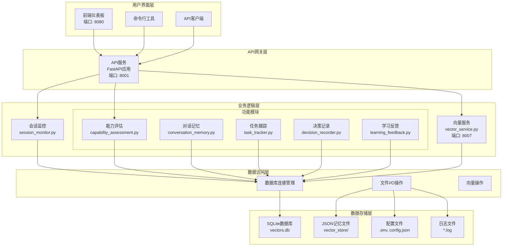
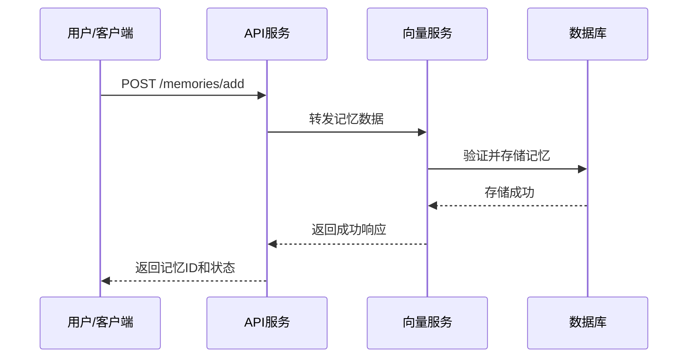
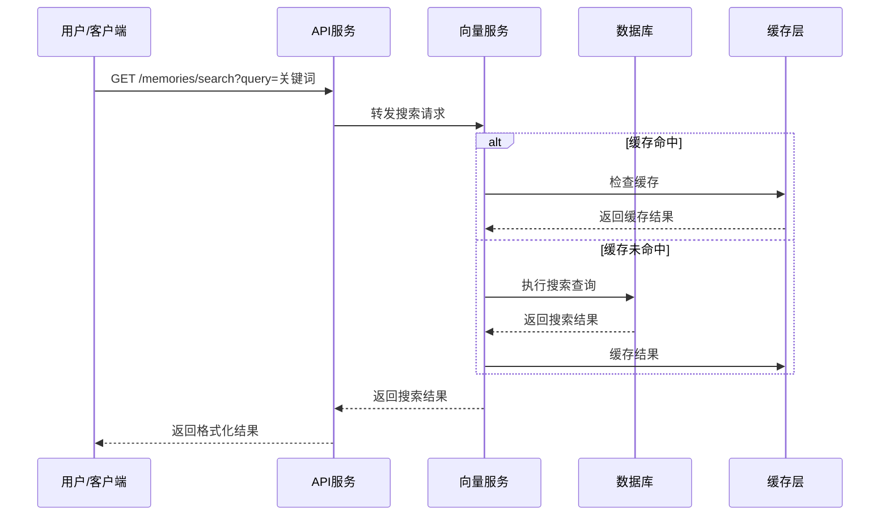
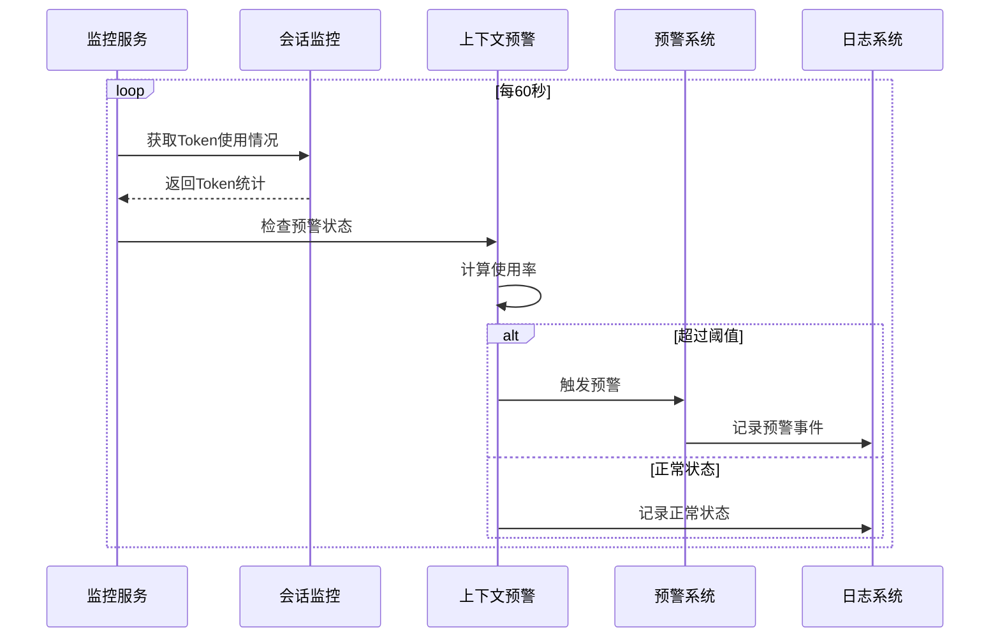

# 系统架构图

## 🏗️ 整体架构



## 🔄 数据流程图

### 记忆添加流程



### 记忆搜索流程



### 系统监控流程



## 📊 组件关系图

### 服务依赖关系

```
┌─────────────────┐    ┌─────────────────┐    ┌─────────────────┐
│   前端服务      │    │   API服务       │    │   向量服务      │
│   (端口: 8080)  │◄──►│   (端口: 8001)  │◄──►│   (端口: 8007)  │
└─────────────────┘    └────────┬────────┘    └─────────────────┘
                                 │
                    ┌────────────┴────────────┐
                    │                         │
            ┌───────────────┐        ┌───────────────┐
            │  会话监控     │        │  上下文预警   │
            │  (后台服务)   │        │  (预警系统)   │
            └───────────────┘        └───────────────┘
                    │                         │
            ┌───────────────┐        ┌───────────────┐
            │  功能模块     │        │  配置文件     │
            │  (modules/)   │        │  (.env, json) │
            └───────────────┘        └───────────────┘
```

### 数据库表结构

```sql
-- 向量表（核心表）
CREATE TABLE vectors (
    id INTEGER PRIMARY KEY AUTOINCREMENT,
    content TEXT NOT NULL,               -- 记忆内容
    vector BLOB,                         -- 向量数据（预留）
    metadata TEXT,                       -- 元数据（JSON格式）
    vector_type TEXT,                    -- 向量类型
    type TEXT,                           -- 记忆类型
    type_name TEXT,                      -- 类型名称
    importance INTEGER DEFAULT 1,        -- 重要性（1-5）
    created_at TIMESTAMP DEFAULT CURRENT_TIMESTAMP,
    updated_at TIMESTAMP DEFAULT CURRENT_TIMESTAMP
);

-- 索引
CREATE INDEX idx_vector_type ON vectors(vector_type);
CREATE INDEX idx_created_at ON vectors(created_at);
CREATE INDEX idx_importance ON vectors(importance);
CREATE INDEX idx_search_content ON vectors(content);
```

## 🚀 部署架构

### 单机部署架构

```
┌─────────────────────────────────────────────────────────┐
│                   单机部署环境                          │
├─────────────────────────────────────────────────────────┤
│  ┌──────────┐  ┌──────────┐  ┌──────────┐             │
│  │ API服务  │  │ 向量服务 │  │ 前端服务 │             │
│  │ :8001    │  │ :8007    │  │ :8080    │             │
│  └──────────┘  └──────────┘  └──────────┘             │
│                                                        │
│  ┌──────────────────────────────────────────────┐     │
│  │              数据存储                         │     │
│  │  • vectors.db (SQLite)                       │     │
│  │  • vector_store/ (JSON文件)                  │     │
│  │  • 配置文件 (.env, config.json)              │     │
│  │  • 日志文件 (*.log)                          │     │
│  └──────────────────────────────────────────────┘     │
└─────────────────────────────────────────────────────────┘
```

### 分布式部署架构（可选）

```
┌─────────────────────────────────────────────────────────┐
│                   负载均衡器                            │
│                   (Nginx/HAProxy)                       │
└──────────────┬──────────────────┬───────────────────────┘
               │                  │
    ┌──────────▼──────────┐ ┌─────▼──────────┐
    │     服务器节点1      │ │   服务器节点2   │
    ├─────────────────────┤ ├─────────────────┤
    │ • API服务 (:8001)   │ │ • API服务 (:8001)│
    │ • 向量服务 (:8007)  │ │ • 向量服务 (:8007)│
    │ • 共享数据库连接    │ │ • 共享数据库连接  │
    └─────────────────────┘ └─────────────────┘
               │                  │
    ┌──────────▼──────────────────▼──────────┐
    │          共享存储层                      │
    │  • 中心化数据库 (PostgreSQL/MySQL)      │
    │  • 对象存储 (S3/MinIO)                  │
    │  • 缓存服务 (Redis)                     │
    └─────────────────────────────────────────┘
```

## 🔧 技术栈架构

### 后端技术栈

```
┌─────────────────────────────────────────────────────────┐
│                   应用框架层                            │
│  • FastAPI - Web框架和API开发                          │
│  • Uvicorn - ASGI服务器                                │
│  • Pydantic - 数据验证和序列化                         │
└──────────────────────────┬──────────────────────────────┘
                           │
┌──────────────────────────▼──────────────────────────────┐
│                   业务逻辑层                            │
│  • 自定义模块 - 功能实现 (modules/)                     │
│  • SQLAlchemy - ORM框架 (可选)                         │
│  • 异步处理 - asyncio/aiohttp                          │
└──────────────────────────┬──────────────────────────────┘
                           │
┌──────────────────────────▼──────────────────────────────┐
│                   数据访问层                            │
│  • SQLite3 - 嵌入式数据库                              │
│  • JSON - 配置文件和数据交换                           │
│  • 文件I/O - 本地文件操作                              │
└─────────────────────────────────────────────────────────┘
```

### 前端技术栈

```
┌─────────────────────────────────────────────────────────┐
│                   用户界面层                            │
│  • HTML5 - 页面结构                                    │
│  • CSS3 - 样式和布局                                   │
│  • JavaScript - 交互逻辑                               │
└──────────────────────────┬──────────────────────────────┘
                           │
┌──────────────────────────▼──────────────────────────────┐
│                   前端框架                              │
│  • 原生JS - 轻量级实现                                  │
│  • Fetch API - HTTP请求                                │
│  • 现代CSS - Flexbox/Grid布局                          │
└─────────────────────────────────────────────────────────┘
```

## 📈 扩展架构

### 插件系统架构

```
┌─────────────────────────────────────────────────────────┐
│                   插件管理器                            │
│  • 插件发现和加载                                      │
│  • 依赖管理                                            │
│  • 生命周期管理                                        │
└──────────────────────────┬──────────────────────────────┘
                           │
    ┌──────────────────────┼──────────────────────┐
    │                      │                      │
┌───▼──────┐        ┌─────▼──────┐        ┌─────▼──────┐
│ 插件A     │        │ 插件B     │        │ 插件C     │
│ • 功能实现│        │ • 功能实现│        │ • 功能实现│
│ • 配置    │        │ • 配置    │        │ • 配置    │
│ • 接口    │        │ • 接口    │        │ • 接口    │
└──────────┘        └───────────┘        └───────────┘
```

### 微服务架构（未来扩展）

```
┌──────────┐    ┌──────────┐    ┌──────────┐    ┌──────────┐
│ API网关  │◄──►│ 记忆服务 │◄──►│ 用户服务 │◄──►│ 认证服务 │
│ (Gateway)│    │ (Memory) │    │ (User)   │    │ (Auth)   │
└──────────┘    └──────────┘    └──────────┘    └──────────┘
      │               │               │               │
      ▼               ▼               ▼               ▼
┌──────────┐    ┌──────────┐    ┌──────────┐    ┌──────────┐
│ 配置中心  │    │ 监控服务 │    │ 日志服务 │    │ 消息队列 │
│ (Config) │    │ (Monitor)│    │ (Log)    │    │ (MQ)     │
└──────────┘    └──────────┘    └──────────┘    └──────────┘
```

## 🔐 安全架构

### 安全层架构

```
┌─────────────────────────────────────────────────────────┐
│                   应用安全层                            │
│  • 输入验证和过滤                                      │
│  • 输出编码和转义                                      │
│  • 会话管理                                            │
└──────────────────────────┬──────────────────────────────┘
                           │
┌──────────────────────────▼──────────────────────────────┐
│                   传输安全层                            │
│  • HTTPS/TLS加密                                        │
│  • 证书管理                                            │
│  • 安全头设置                                          │
└──────────────────────────┬──────────────────────────────┘
                           │
┌──────────────────────────▼──────────────────────────────┐
│                   访问控制层                            │
│  • 身份验证 (JWT/OAuth)                                │
│  • 授权和权限控制                                      │
│  • 速率限制                                            │
└──────────────────────────┬──────────────────────────────┘
                           │
┌──────────────────────────▼──────────────────────────────┐
│                   数据安全层                            │
│  • 数据加密 (传输/存储)                                │
│  • 敏感信息保护                                        │
│  • 审计日志                                            │
└─────────────────────────────────────────────────────────┘
```

## 📋 架构决策记录

### ADR-001: 选择SQLite作为数据库

**状态**: 已接受  
**日期**: 2026-03-28  
**上下文**: 需要轻量级、零配置的数据库解决方案  
**决策**: 使用SQLite作为主要数据存储  
**后果**: 
- ✅ 无需单独数据库服务器
- ✅ 部署简单，单文件存储
- ✅ 支持事务和ACID特性
- ⚠️ 不适合高并发写场景
- ⚠️ 缺乏内置复制功能

### ADR-002: 选择FastAPI作为Web框架

**状态**: 已接受  
**日期**: 2026-03-28  
**上下文**: 需要高性能、易用的Python Web框架  
**决策**: 使用FastAPI构建RESTful API  
**后果**:
- ✅ 高性能，基于Starlette和Pydantic
- ✅ 自动API文档生成
- ✅ 类型提示和验证
- ✅ 异步支持
- ⚠️ 相对较新的框架，生态系统较小

### ADR-003: 模块化架构设计

**状态**: 已接受  
**日期**: 2026-03-28  
**上下文**: 需要可扩展、易维护的系统架构  
**决策**: 采用模块化设计，分离关注点  
**后果**:
- ✅ 代码可维护性高
- ✅ 易于测试和调试
- ✅ 支持功能扩展
- ✅ 团队协作更方便
- ⚠️ 初始开发复杂度稍高
- ⚠️ 需要良好的接口设计

### ADR-004: 简化向量搜索实现

**状态**: 已接受  
**日期**: 2026-03-28  
**上下文**: 需要轻量级记忆搜索功能  
**决策**: 使用SQL LIKE查询代替完整向量搜索  
**后果**:
- ✅ 实现简单，无需外部依赖
- ✅ 资源占用少
- ✅ 易于理解和维护
- ⚠️ 搜索精度有限
- ⚠️ 不支持语义搜索
- ⚠️ 性能随数据量增长下降

## 🎯 架构演进路线

### 阶段1: 基础版本 (当前)
- ✅ 单机部署
- ✅ SQLite数据库
- ✅ 基础记忆管理
- ✅ 简单搜索功能
- ✅ 基本监控

### 阶段2: 增强版本 (计划中)
- 🔄 支持PostgreSQL/MySQL
- 🔄 真正的向量搜索
- 🔄 用户管理和认证
- 🔄 高级监控和告警
- 🔄 API版本管理

### 阶段3: 企业版本 (未来)
- 📅 微服务架构
- 📅 高可用部署
- 📅 分布式缓存
- 📅 消息队列集成
- 📅 容器化部署

### 阶段4: 云原生版本 (远景)
- 🌟 Kubernetes部署
- 🌟 服务网格集成
- 🌟 自动扩缩容
- 🌟 多云支持
- 🌟 AI/ML集成

---

*架构图最后更新: 2026-03-28*  
*架构版本: 1.0.0*  
*维护者: 系统架构团队*